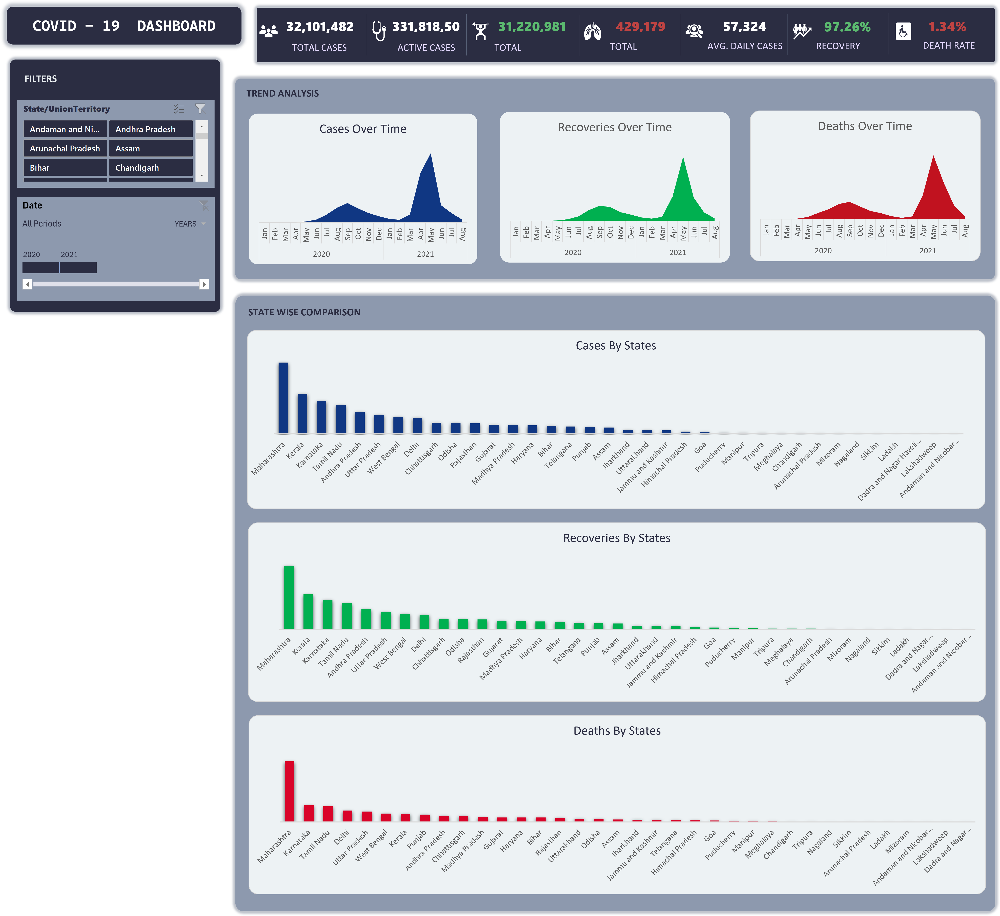
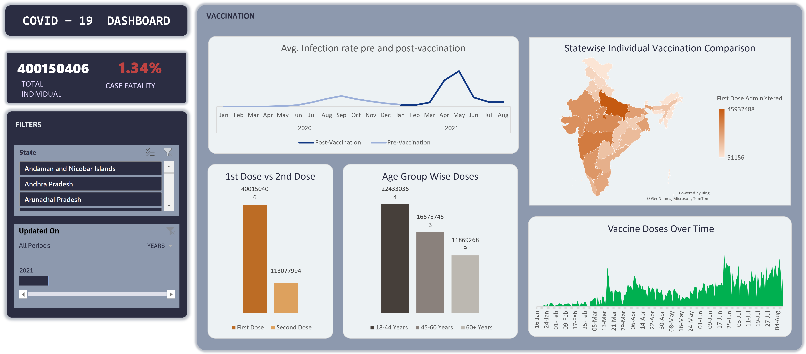
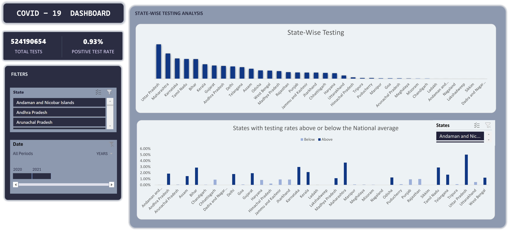

# 🏥 Pandemic Patterns: Unveiling COVID-19 Dynamics in India Through Excel Dashboard Analytics

## 📸 Dashboard Preview

*(Add screenshots here of your dashboard for quick visualization)*

### Overview Dashboard



### Statewise Vaccination Dashboard


### Statewise Testing Dashboard


## 📌 Project Overview

This project analyzes the **spread, testing, and vaccination progress of COVID-19 in India** using multiple datasets and presents insights through an **interactive Excel dashboard**.

The goal is to leverage Excel’s **data manipulation, statistical analysis, and visualization capabilities** to uncover pandemic trends, assess the effectiveness of health measures, and provide policymakers and the public with **data-driven insights**.

---

## 🧾 Background

In late 2019, the world witnessed the emergence of **SARS-CoV-2**, leading to the global **COVID-19 pandemic**.
India, with its vast and diverse population, faced immense challenges in tracking cases, testing, and vaccination. This deluge of data presents an opportunity to **understand the pandemic’s dynamics** at a granular level.

Through this case study, we aim to:

* Track **daily confirmed cases, recoveries, deaths, and testing patterns** across states.
* Examine the **progress of vaccination campaigns**.
* Develop an **interactive Excel dashboard** to simplify trend analysis and decision-making.

---

## 🎯 Objectives

1. Perform **end-to-end analysis** of COVID-19 data (cases, testing, vaccination).
2. Apply **Excel functions, formulas, and data cleaning techniques**.
3. Conduct **statistical and comparative analyses** (e.g., case fatality rate, pre vs. post-vaccination trends).
4. Build an **interactive dashboard** with slicers, timelines, and dynamic charts.
5. Provide **visual storytelling and actionable insights** for pandemic management.

---

## 📂 Datasets Used

1. **COVID-19 Cases** → [covid\_19\_india.csv](#)

   * Daily reported confirmed cases, recoveries, and deaths across states.
   * Columns: Date, State/UT, Confirmed, Cured, Deaths, etc.

2. **Vaccination Data** → [covid\_vaccine\_statewise.csv](#)

   * Dose-wise and demographic vaccination details.
   * Columns: State, First Dose, Second Dose, Age-group data, Gender split, etc.

3. **Testing Data** → [StatewiseTestingDetails.csv](#)

   * State-wise COVID-19 testing stats.
   * Columns: Date, State, Total Samples, Positive, Negative.

---

## 🔎 Part 1: Excel Data Analysis

Key analysis performed before dashboard creation:

* ✅ Missing data handling & date normalization
* ✅ Daily new cases calculation (state-wise)
* ✅ State contribution to national total cases
* ✅ Monthly and weekly case trends (pivot tables)
* ✅ Positive rate calculation (tests vs. positives)
* ✅ Vaccination progress & age-group analysis
* ✅ Correlation: Testing vs. Case Detection
* ✅ Comparative study: Pre vs. Post vaccination infection rates
* ✅ Forecasting next 30 days using Excel time-series tools
* ✅ Risk assessment categories (High, Medium, Low)

> **Note:** Visualizations were included at each step for better interpretation.

---

## 📊 Part 2: Excel Dashboard

An **interactive Excel dashboard** was developed to consolidate insights.

### Key Features:

* **📌 Case Summary Panel** – Total confirmed, active, recoveries, deaths
* **💉 Vaccination Tracker** – Statewise vaccination progress, age/gender breakdown
* **🧪 Testing Insights** – Total tests, positive rates, state comparisons
* **📈 Trend Analysis Graphs** – Time-series for cases, deaths, recoveries, vaccinations
* **🗺️ State Impact Overview** – Heatmaps & bar charts for comparative analysis
* **📊 Statistical Insights** – CFR trends, pre vs. post-vaccine infection rates
* **🎛️ Interactive Controls** – Slicers, dropdowns, timeline sliders
* **🎨 Design Focus** – Clean layout, consistent theme, intuitive navigation

---

## 🚀 How to Use

1. Clone this repository:

    ```bash
    git clone https://github.com/pandey-rakshit/Healthcare-Covid-19-India-Excel-Dashboard.git
    ```
2. Open the Excel file:

   * Navigate to `/Covid-19 India Analysis.xlsx`

3. Use **slicers/timelines** to filter by **state, date, or category**.

---

## 📌 Tools & Skills Demonstrated

* **Excel Functions & Formulas**: INDEX, MATCH, VLOOKUP, IF, Array Formulas
* **Data Cleaning**: Standardizing dates, handling missing data
* **Statistical Analysis**: Positive rates, CFR, correlation analysis
* **Visualization**: Pivot charts, line/area plots, heat maps
* **Dashboarding**: Slicers, timelines, conditional formatting
